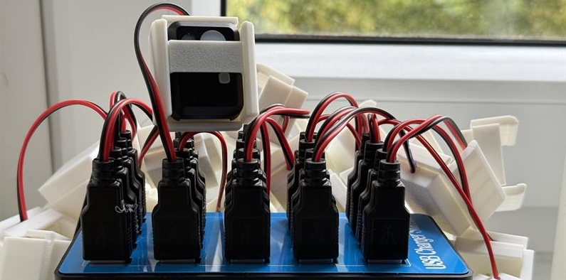
## Charging Farm

This repository contains the necessary files for 3D printing the charging unit for the **Actilumus (Condor)** device. In addition to 

I used **PLA filament** to print all parts. After soldering the components, the connections were secured with hot glue. The pins were also fixed in place after being soldered onto a **PCB board**.

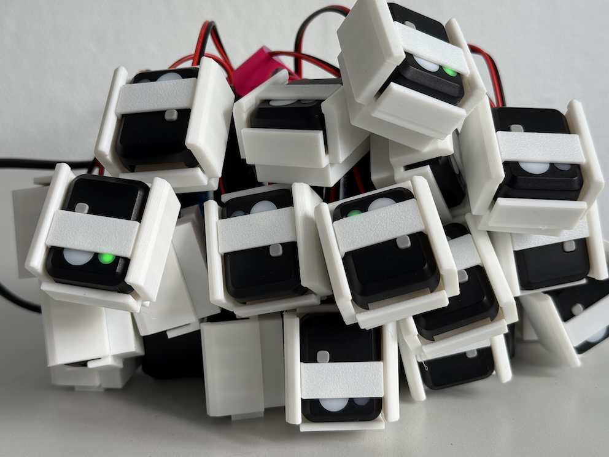

### Additional Parts Used

1. **USB 2.0 Type A Male Socket 4-Pin Plug Connector:**
   [Available here](https://www.amazon.de/dp/B077P1PGGN?ref=ppx_yo2ov_dt_b_fed_asin_title) (or any similar products)

2. **22AWG Electric Wire:**, 2-Core (Black/Red)
   [Available here](https://www.amazon.de/dp/B0BG54KWG2?ref=ppx_yo2ov_dt_b_fed_asin_title) (or any similar products)

3. **Pogo Pin Spring Pressure Probe:** — Diameter: 0.8 mm, Length: 6 mm
   [Available here](https://www.amazon.de/dp/B07WP196KW?ref=ppx_yo2ov_dt_b_fed_asin_title) (or any similar products)

4. **Perforated PCB Grid Board:**
   [Available here](https://www.amazon.de/-/en/AZDelivery-Board-Perforated-Grid-Book/dp/B078HV79XX?th=1) (or any similar products)

5. **Low Temperature Solder:** [Available here](https://www.amazon.de/-/en/Temperature-Sn42-Bi58-0-8mm-50g/dp/B0CJHQ89T1?th=1) (or any similar products)

### Instruments
1. **Soldering Iron**
2. **Digital Multimeter**

### Files for 3D printing
1. Body: [here!](3D_printing_files/Charging_Port.stl)
2. Back cover: [here!](3D_printing_files/Charging_Port_lead.stl)
3. Top holder: [here!](3D_printing_files/Charging_PortLow.stl)

### Instruction
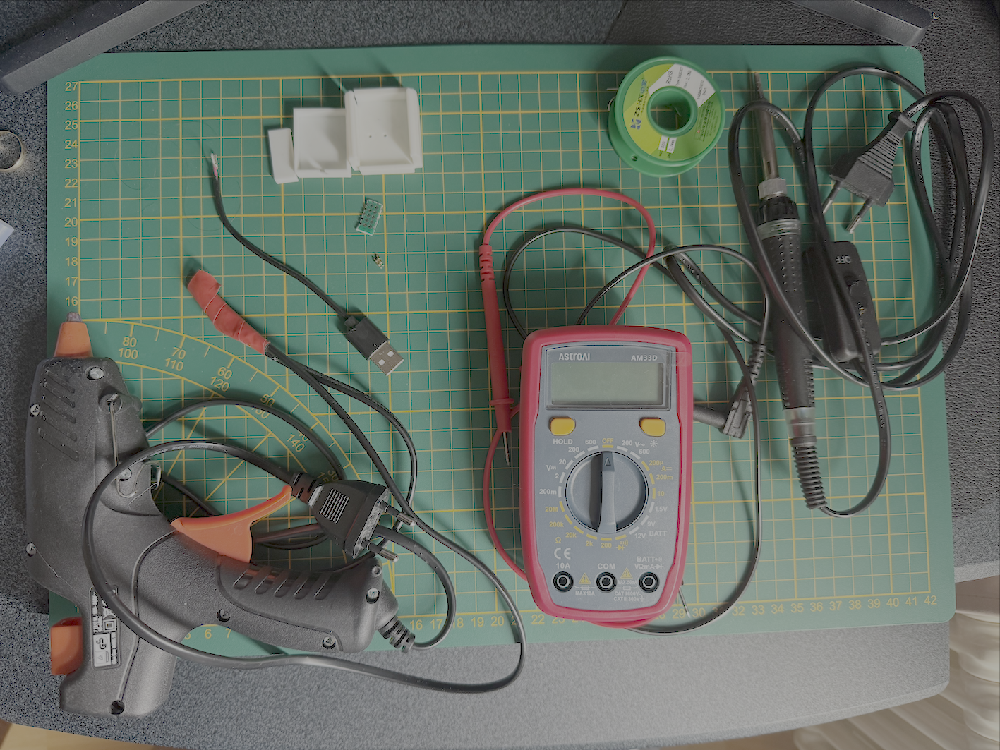
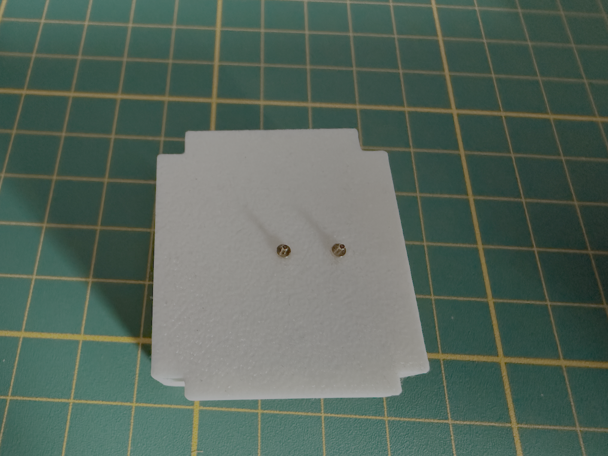
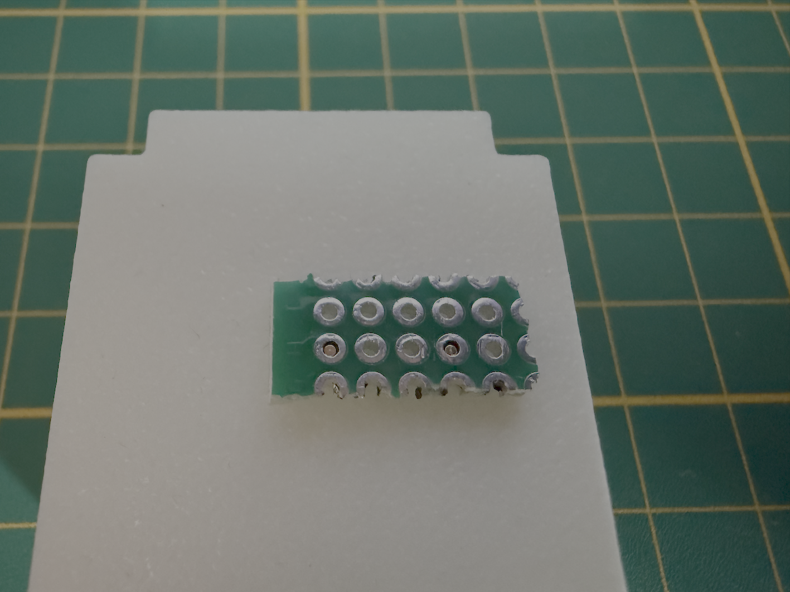
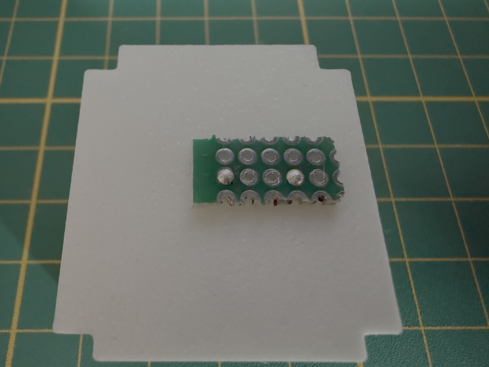
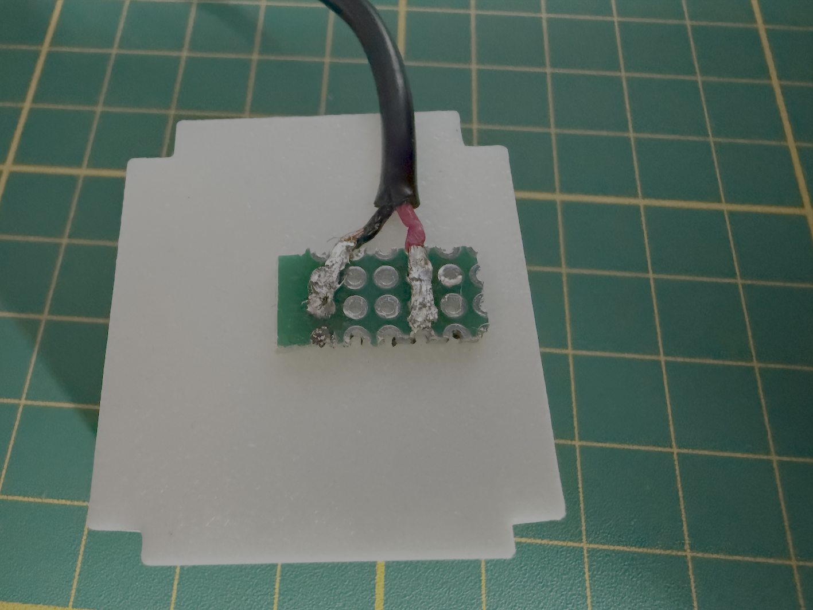
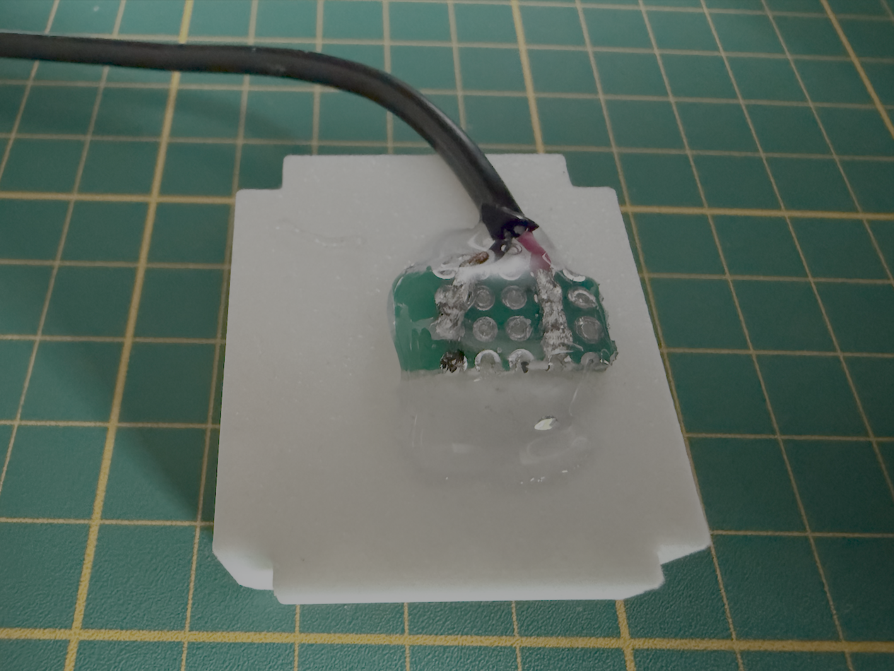
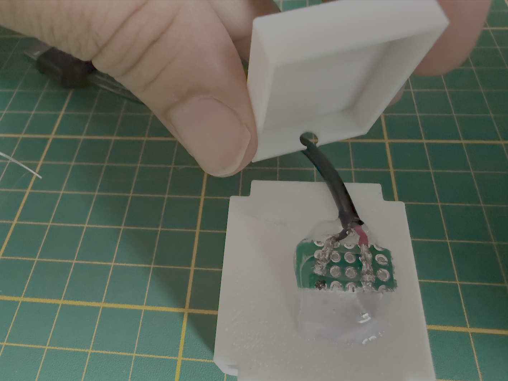
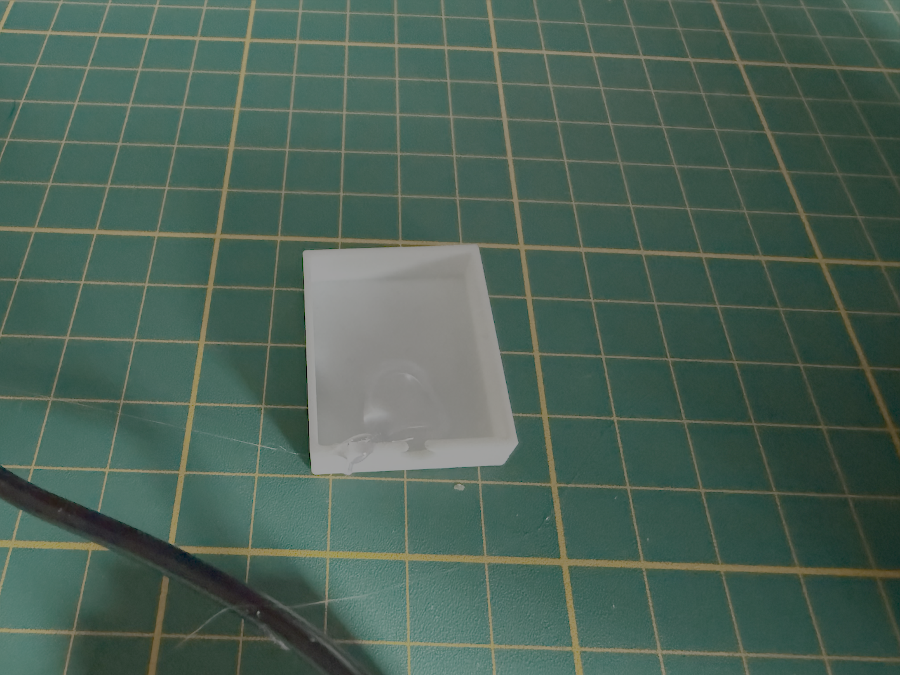
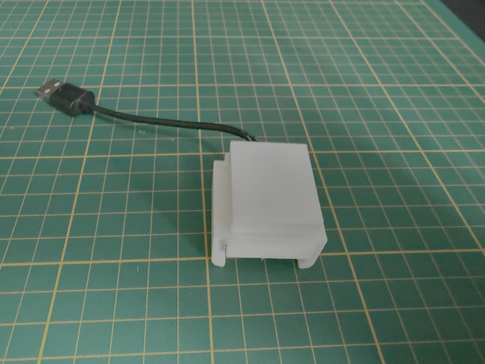
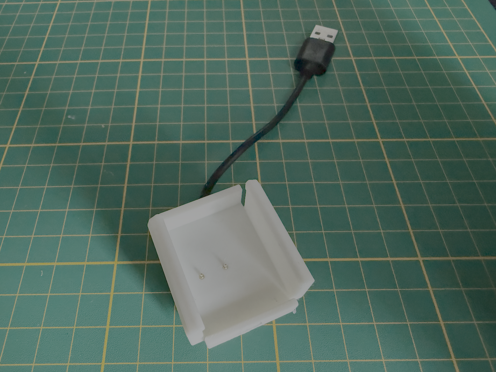
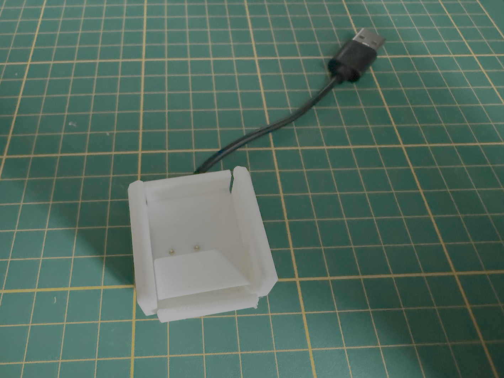

