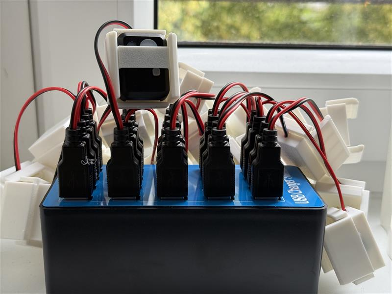

## Charging Farm

This repository contains the necessary files for 3D printing the charging unit for the **Actilumus (Condor)** device.

I used **PLA filament** to print all parts. After soldering the components, the connections were secured with hot glue. The pins were also fixed in place after being soldered onto a **PCB board**.

### Additional Parts Used

1. **USB 2.0 Type A Male Socket 4-Pin Plug Connector** with Black Plastic Cover
   [Available here](https://www.amazon.de/dp/B077P1PGGN?ref=ppx_yo2ov_dt_b_fed_asin_title)

2. **22AWG Electric Wire**, 2-Core (Black/Red)
   [Available here](https://www.amazon.de/dp/B0BG54KWG2?ref=ppx_yo2ov_dt_b_fed_asin_title)

3. **Pogo Pin Spring Pressure Probe** — Diameter: 0.8 mm, Length: 6 mm
   [Available here](https://www.amazon.de/dp/B07WP196KW?ref=ppx_yo2ov_dt_b_fed_asin_title)

4. **Perforated PCB Grid Board**
   [Available here](https://www.amazon.de/-/en/AZDelivery-Board-Perforated-Grid-Book/dp/B078HV79XX?th=1)

